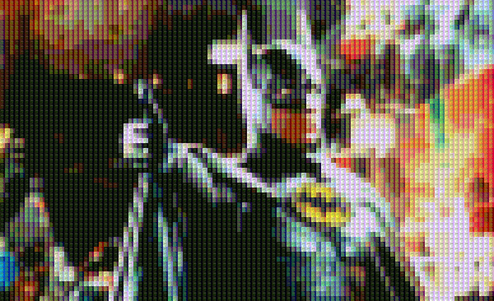

# MosaicMaker
A neat program that takes two images, creates a set of tiles of the first, then generates a mosiac of the second using said tiles.
Inspired by the work of [Daniel Shiffman](https://shiffman.net/). Written in Processing.

### Example

*Original*

*Tile Image*

*Mosaic*

